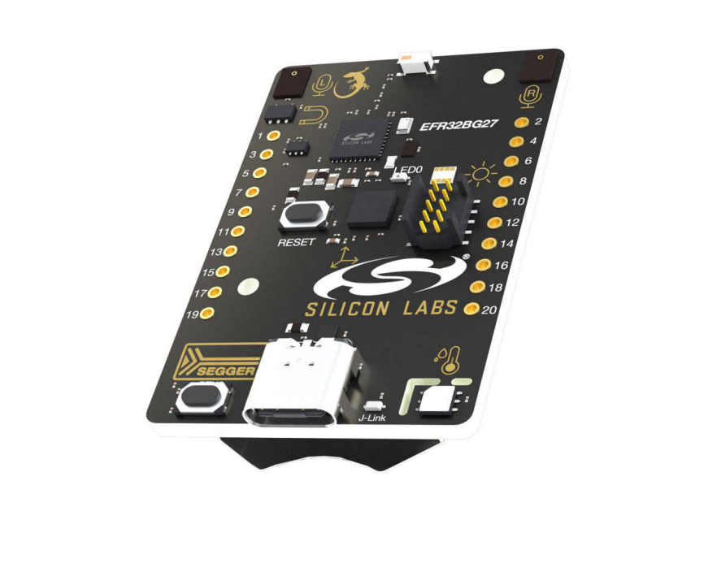
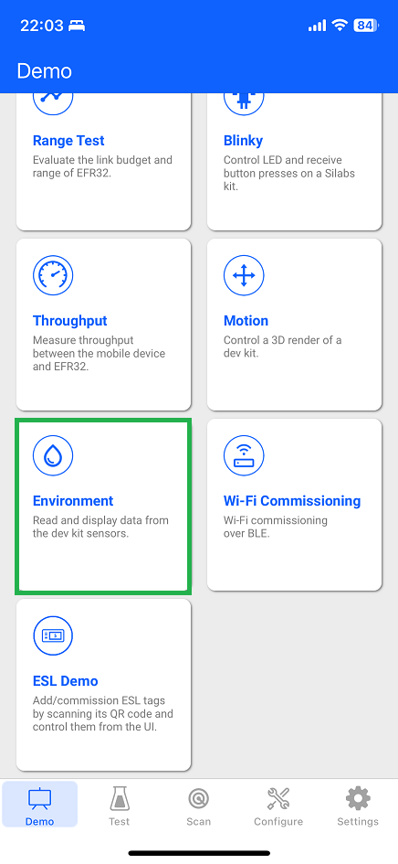
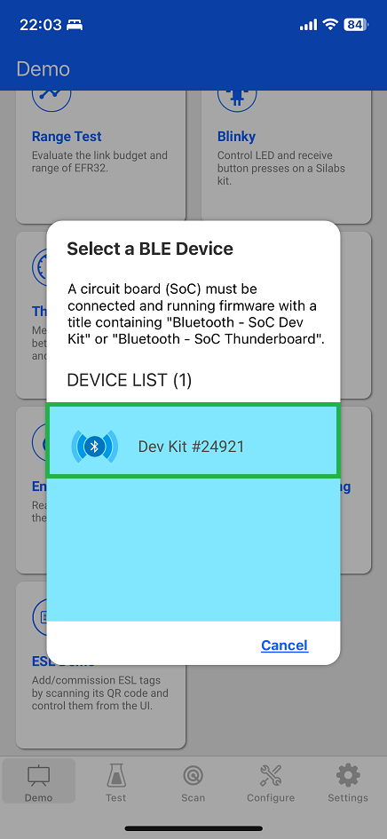
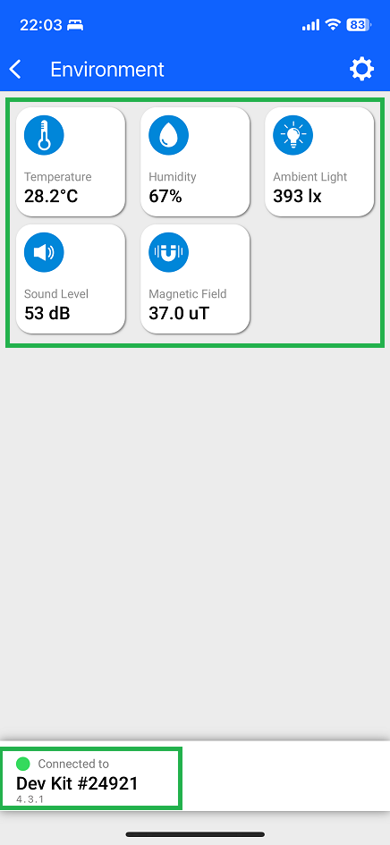
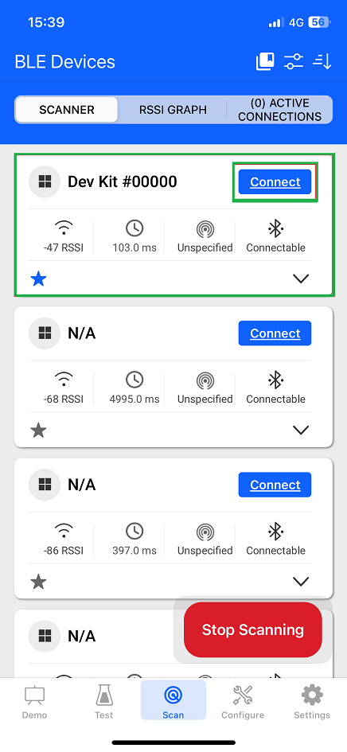
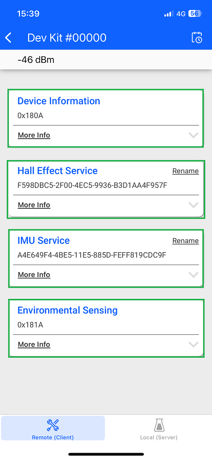
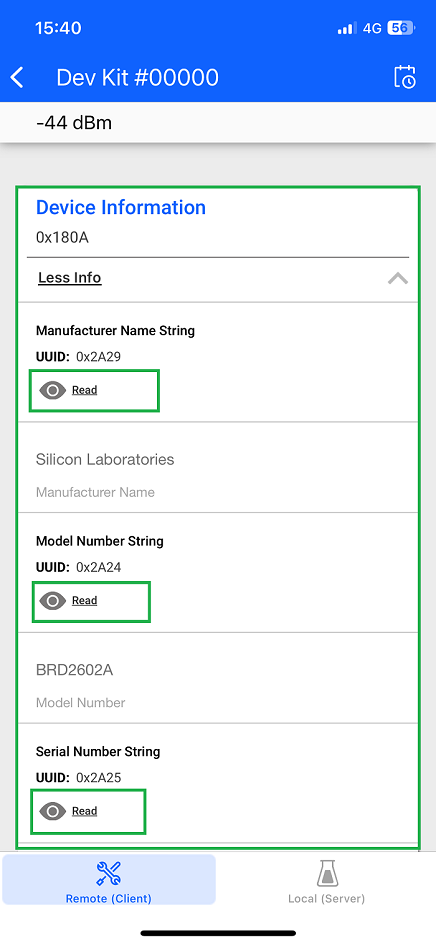
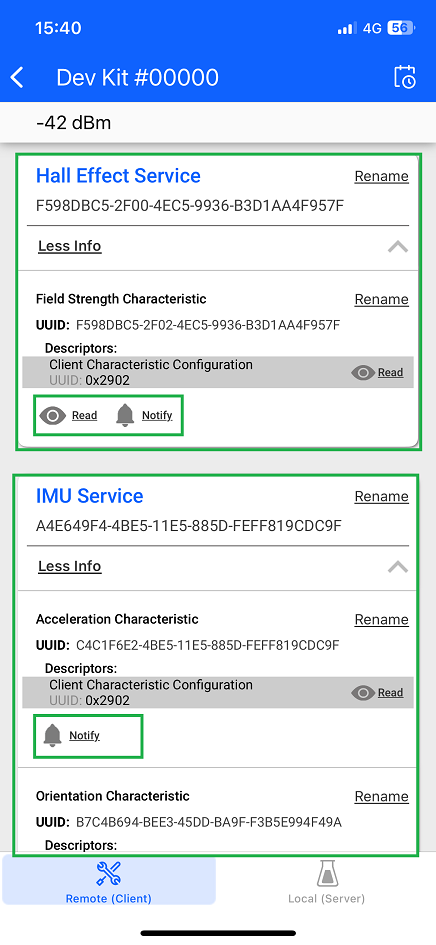
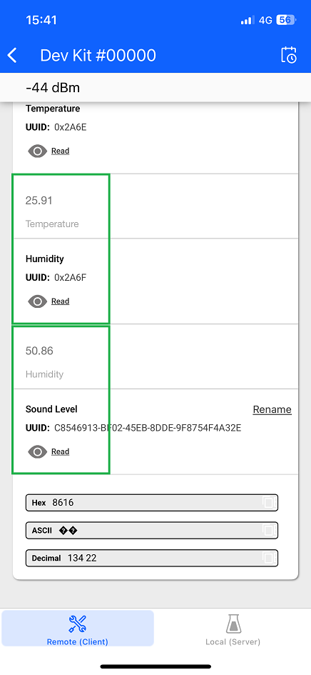
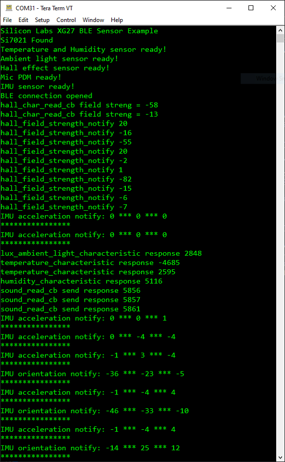

# xG27 Dev Kit sensors BLE example

## Overview

This example showcases the xG27 Dev Kit's built-in sensors using BLE. It collects and processes sensor data from the board and provides graphical feedback via the EFR Connect iOS/Android app.

## Hardware Required

- [EFR32xG27 Dev Kit](https://www.silabs.com/development-tools/wireless/efr32xg27-development-kit)

## Software Required

- [EFR Connect mobile application for Android](https://play.google.com/store/apps/details?id=com.siliconlabs.bledemo)

- [EFR Connect mobile application for iOS](https://itunes.apple.com/us/app/silicon-labs-blue-gecko-wstk/id1030932759?mt=8)

## Setup

The example requires the following libraries:

- [SparkFun_Si7021 Humidity and Temperature Sensor](https://github.com/sparkfun/SparkFun_Si7021_Arduino_Library)
- [SparkFun Ambient Light Sensor](https://github.com/sparkfun/SparkFun_Ambient_Light_Sensor_Arduino_Library)
- [ICM20689](https://github.com/finani/ICM20689)
- Silabs Si7210 Hall Effect Sensor (built-in)
- Silabs Microphone PDM (built-in)

## How It Works

The xG27 Dev Kit contains a set of peripherals that can be accessed from the EFR32BG27. On startup the sketch will start a BLE advertisement with the configured name, then it will accept any incoming connection. The device offers GATT services and characteristics for reporting the data collected from it's onboard sensors including:

- One Silicon Labs Si7021 relative humidity & temperature sensor
- One Silicon Labs Si7210 hall effect sensor
- One Vishay VEML6035 ambient light sensor
- One TDK InvenSense ICM-20648 6-axis inertial measurement sensor
- Two Knowles SPK0641HT4H-1 MEMS microphones with PDM output

### Demonstration

Follow the below steps to test the example:

1. Upload the code to your Arduino board: From Arduino IDE go to Tools > Board and select the Arduino board you’re using "xG27 Dev Kit (BLE)". Go to Tools > Port and select the port your board is connected to. Then, click the upload button.
2. Open the EFR Connect app on your smartphone.
3. Go to Demo tab -> Environment -> Connect to the device with the name "Dev Kit #xxxxx" -> The demo application automatically requests data from the xG27 Dev Kit and displays it on the main dashboard. Or users can use the manual method to get data from the sensor (From step 4 - 5).
4. From EFR Connect App -> Scan -> Find your device in the Bluetooth Browser, advertising as "Dev Kit #xxxxx", and tap Connect.
5. Find the Service at the GATT database. There are four services: Device Information Service, Hall Effect Service, IMU Service, and Environmental Sensing Service. Try to read, re-read the characteristics and enable notification on this service to get the value from sensors.

Open the Serial Monitor at a baud rate of 115200. The sensor measurements will also be displayed there.

