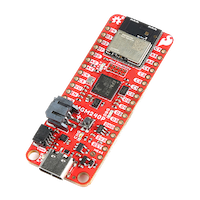
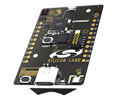
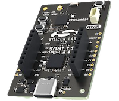
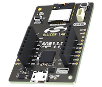
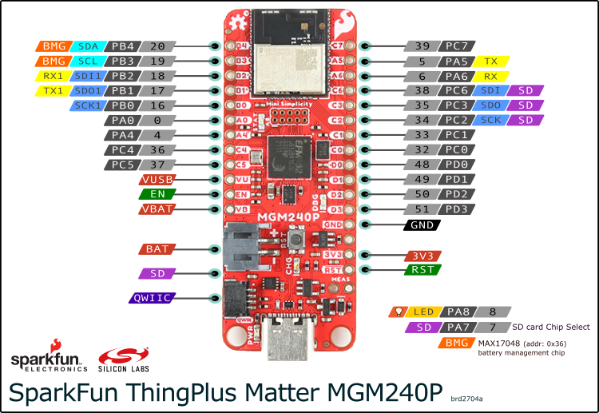
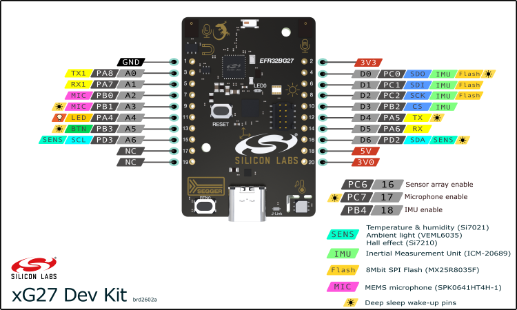
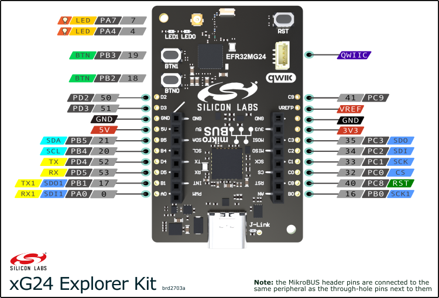

# Silicon Labs Arduino Core


This project enables **Silicon Labs** hardware to be used with the **Arduino** ecosystem.

Currently supported hardware:
 - [SparkFun ThingPlus Matter MGM240P](https://www.sparkfun.com/products/20270)
 - [xG27 Dev Kit](https://www.silabs.com/development-tools/wireless/efr32xg27-development-kit)
 - [xG24 Explorer Kit](https://www.silabs.com/development-tools/wireless/efr32xg24-explorer-kit)
 - [BGM220 Explorer Kit](https://www.silabs.com/development-tools/wireless/bluetooth/bgm220-explorer-kit)






## Installation

 - Download and install the latest [Arduino IDE](https://www.arduino.cc/en/software)
 - Go to the *Settings* menu
 - Enter `https://siliconlabs.github.io/arduino/package_arduinosilabs_index.json` in the *'Additional Boards Manager URLs'* field (add a comma in between if you have multiple URLs)
 - Open the *'Boards Manager'* from the side menu and search for *'Silicon Labs'*
 - Install the *'Silicon Labs'* platform

## Getting started

If you're using your board for the first time with Arduino IDE you need to burn the bootloader first.
 - Select the board you have from the *'Tools > Board'* menu
 - Go to the *'Tools > Programmer'* menu and select *'Simplicity Commander'*
 - After that select the *'Tools > Burn bootloader'* option
 - If you have trouble with flashing you may need to install the *J-Link USB drivers* - it's part of the [J-Link Software and Documentation pack](https://www.segger.com/downloads/jlink/)
 - Verify that everything works by creating a *Blink* example (*File > Examples > 01.Basics > Blink*) and flashing it to your board
 - If you see the built-in led blinking, you're ready to go! Happy coding!

## Variants
Each supported board has a number of different variants depending on the protocol stack used and whether the included SDK is precompiled or not.
For example the *xG24 Explorer Kit* has the following four variants:
- **xG24 Explorer Kit (BLE)** - Bluetooth Low Energy variant
- **xG24 Explorer Kit (BLE) (precomp)** - Bluetooth Low Energy variant with a precompiled SDK
- **xG24 Explorer Kit (Matter)** - Matter variant
- **xG24 Explorer Kit (Matter) (precomp)** - Matter variant with a precompiled SDK

This naming scheme applies to all other boards as well. When developing applications for a certain protocol make sure the correct variant is selected.

The *precomp* and *regular* variants produce the same binary at the end - however the precompiled SDK variants offer a much faster compilation speed, but debugging on them is limited on the SDK part.

## Matter library


The core comes bundled with the `Matter` library. The library's goal is to make using Matter, creating and managing devices easy and user-friendly.

The library sits on top of Silicon Labs' Matter SDK which is included in the *(Matter)* variants of the boards that support the protocol. Make sure to select the *(Matter)* variant of the board you're using Matter with to have the SDK required by the library included.

See the docs for the Matter library [here](libraries/Matter/readme.md).

## ezBLE
`ezBLE` is an Arduino library which makes sending and receiving data over BLE super simple. It provides the same API as `Serial` and handles connections, discovery, data transfer, and all BLE tasks in the background. It's compatible with all Silicon Labs BLE hardware.

You can use it the same way as Serial to transfer data over BLE. You'll need at least two devices, one acting as a server and one as a client. Once the connection is established the communication is bidirectional, each device can send and receive data from each other over BLE.

Initialize it as client or server:
```
ezBLE.beginClient()
```

or
```
ezBLE.beginServer()
```

You can optionally name your ezBLE nodes to separate them from others. The client and the server will both look for the configured name and connect to each other:
```
ezBLE.beginClient("myCustomEzBleName")
```
```
ezBLE.beginServer("myCustomEzBleName")
```


Wait for the connection to establish:
```
while(!ezBLE.connected());
```

Send data:
```
ezBLE.println("Hello, BLE!")
```

Receive data:
```
while(ezBLE.available()) {
  Serial.print((char)ezBLE.read());
}
```

The `ezBLE` library is shipped with the core, no need to download it separately. See the included examples for full code.

## Additional APIs
There are some additional functions besides the standard Arduino API you can call on Silicon Labs boards:
 - `getCpuTemp()` - returns the die temperature in Celsius
 - `systemReset()` - issues a system reset and restarts the MCU
 - `getMcuUniqueId()` - returns the unique ID of the microcontroller
 - `getMcuUniqueIdStr()` - returns the unique ID of the microcontroller in hexadecimal as a string
 - `getCoreVersion()` - returns the current core version as a string
 - `setCPUClock()` - sets the CPU clock speed - it can be one of  `CPU_40MHZ`, `CPU_76MHZ`, `CPU_80MHZ`
 - `getCPUClock()` - returns the current CPU speed in hertz
 - `analogReferenceDAC()` - selects the voltage reference for the DAC hardware


## Debugging
All Silicon Labs boards come equipped with an onboard *SEGGER J-Link debugger* which can be used from the Arduino IDE. In order to utilize this feature you'll need the following:
 - The [J-Link Software and Documentation pack](https://www.segger.com/downloads/jlink/) installed on your system
 - A debugger configuration file next to your sketch

### Debugger configuration file
Go to the folder where your sketch is located and create a file named `debug_custom.json` - and add the following content to it:
```
{
    "servertype": "jlink",
    "device": "EFR32MG24B210F1536IM48",
    "interface": "SWD",
    "serverpath": "JLinkGDBServer"
}
```
This is a sample debugging configuration for the xG24 Explorer Kit. You most likely need to change some values to make it work on your system and board.

Change the `device` property according to the MCU on your board. Here's a table for help:
| Board                                  | MCU           |
| -------------                          |:-------------:|
| SparkFun ThingPlus Matter MGM240P      | MGM240PB32VNA          |
| xG27 Dev Kit                           | EFR32BG27C140F768IM40  |
| xG24 Explorer Kit                      | EFR32MG24B210F1536IM48 |
| BGM220 Explorer Kit                    | BGM220PC22HNA          |


Change the `serverpath` property to the location of *JLinkGDBServer* on your system. *JLinkGDBServer* is installed with the *J-Link Software and Documentation pack*.

 - On Windows it's usually at `C:/Program Files/SEGGER/JLink/JLinkGDBServerCL`
 - On Linux and macOS you can just use `JLinkGDBServer` without the full path if it's on your PATH

You can begin a debug session by pressing the `Start debugging` button in the top left corner next to the *Verify* and *Upload* buttons in the Arduino IDE.

There are two examples provided with a debugger configuration for the *SparkFun ThingPlus Matter MGM240P* board - one for Unix-based systems (Linux and macOS) and one for Windows.
You can find them under *File > Examples > SiliconLabs > thingplusmatter_debug_unix/win*.
These examples can be easily modified to work with the other boards just by changing the `device` property in `debug_custom.json`.

Here's the [official Arduino guide](https://docs.arduino.cc/tutorials/mkr-wifi-1010/mkr-jlink-setup#installing-the-j-link-gdb-server-software) on using SEGGER J-Link debuggers.

## Limitiations

The project is under constant development and there are a few things which come with some limitations.

### Bluetooth LE API
Bluetooth LE is available on all supported devices, however the Arduino BLE API is not supported yet. You can use BLE with Silicon Labs' own [BLE API](https://docs.silabs.com/bluetooth/6.1.0/bluetooth-stack-api/). There are a handful of examples included to demonstrate how you can create BLE devices with the Silicon Labs API. Support for the Arduino BLE API is under development and will be available in a future release.

### USB-UART baud rate
The UART baud rate of Serial can be changed freely - however if you're using it through the USB-UART bridge then it only works with *115200 bps* by default.
This is because the Silicon Labs boards use an EFM32 microcontroller as a board controller/debugger/flasher/USB-UART converter and this controller has a separate configuration.
If you wish to change the baud rate used through the USB-UART bridge, then you can configure the board controller to use a different speed from it's admin console. The admin console can be reached from [Simplicity Studio](https://www.silabs.com/developers/simplicity-studio). Use [this](https://community.silabs.com/s/article/wstk-virtual-com-port-baudrate-setting?language=en_US) guide to change the baud rate in the board controller. The baud rate in your sketch must match the baud rate configured in the board controller - otherwise communication won't work.

### Uploading firmware to multiple devices
As of now the included programmer utility cannot distinguish between multiple devices based on their serial ports. This means that you can only have one board connected at a time in order for programming to be successful.

## Questions and help

Have a question or stuck somewhere? Made something cool? 🕹️ Hit us up on Reddit at [r/silabs](https://www.reddit.com/r/silabs/)!

If you encounter an issue you can also submit it to the project issues.

## Resources for the supported boards
### SparkFun ThingPlus Matter MGM240P
[Product page](https://www.sparkfun.com/products/20270) |
[Overview & guide](https://learn.sparkfun.com/tutorials/sparkfun-thing-plus-matter---mgm240p-hookup-guide)

#### Pinout diagram

### xG27 Dev Kit

[Product page](https://www.silabs.com/development-tools/wireless/efr32xg27-development-kit) |
[User guide](https://www.silabs.com/documents/public/user-guides/ug554-brd2602a-user-guide.pdf)
#### Pinout diagram


### xG24 Explorer Kit

[Product page](https://www.silabs.com/development-tools/wireless/efr32xg24-explorer-kit) |
[User guide](https://www.silabs.com/documents/public/user-guides/ug533-xg24-ek2703a.pdf)
#### Pinout diagram


### BGM220 Explorer Kit

[Product page](https://www.silabs.com/development-tools/wireless/bluetooth/bgm220-explorer-kit) |
[User guide](https://www.silabs.com/documents/public/user-guides/ug465-brd4314a.pdf)

## Core development
We use **uncrustify** to ensure consistent code formatting.

Use the config under *package/uncrustify.cfg* to automatically adhere to formatting rules.

##


###### Made with ❤️ at Silicon Labs
