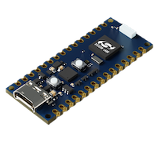
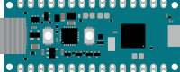
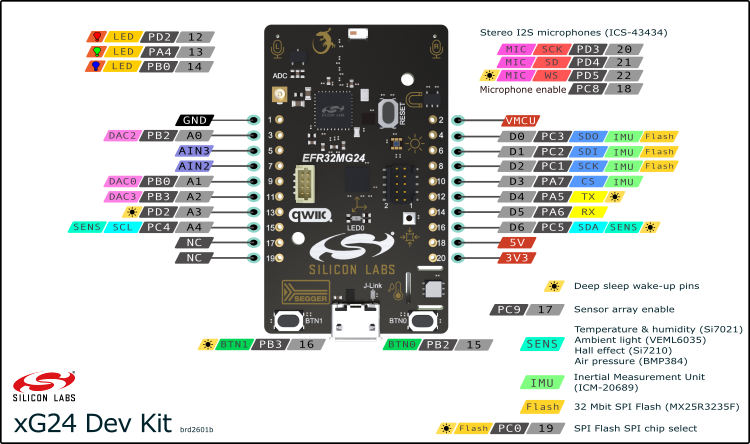
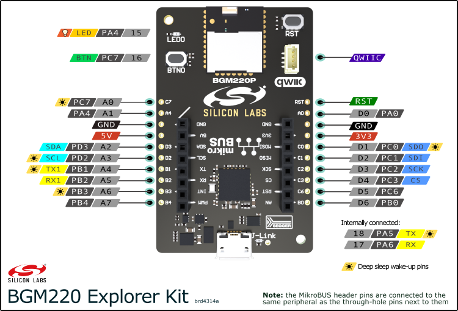

# Silicon Labs Arduino Core


This project enables **Silicon Labs** hardware to be used with the **Arduino** ecosystem.

[](https://github.com/SiliconLabs/arduino/releases/latest/)
[](https://github.com/SiliconLabs/arduino/releases/latest/)

#### Currently supported hardware:
 - [Arduino Nano Matter](https://store.arduino.cc/pages/nano-matter)  
 - [SparkFun Thing Plus Matter MGM240P](https://www.sparkfun.com/products/20270)  
 - [Silicon Labs xG24 Explorer Kit](https://www.silabs.com/development-tools/wireless/efr32xg24-explorer-kit)  
 - [Silicon Labs xG24 Dev Kit](https://www.silabs.com/development-tools/wireless/efr32xg24-dev-kit)  
 - [Silicon Labs xG27 Dev Kit](https://www.silabs.com/development-tools/wireless/efr32xg27-development-kit) 
 - [Silicon Labs BGM220 Explorer Kit](https://www.silabs.com/development-tools/wireless/bluetooth/bgm220-explorer-kit) 




## Installation

 - Download and install the latest [Arduino IDE](https://www.arduino.cc/en/software) (only the newer 2.x versions are supported - the legacy 1.x versions are not)
 - Open the *'Settings / Preferences'* window
 - Open the *'Boards Manager'* from the side menu and search for *'Silicon Labs'*
   - If it does not show up - enter `https://siliconlabs.github.io/arduino/package_arduinosilabs_index.json` in the *'Additional Boards Manager URLs'* field (add a comma in between if you have multiple URLs)
 - Install the `Silicon Labs` platform

## Getting started

If you're using your board for the first time with Arduino IDE you need to burn the bootloader first.
Burning the bootloader fully erases the flash memory first, then burns the bootloader. You only need to do this once during the initial setup or if you are changing Matter device types and/or want to move your device to a different Matter network.
 - Select the board you have from the *'Tools > Board'* menu
 - Go to the *'Tools > Programmer'* menu and select *'Simplicity Commander'* or *'openOCD'* for the Nano Matter
 - After that select the *'Tools > Burn bootloader'* option
 - If you have trouble with flashing you may need to install the *J-Link USB drivers* - it's part of the [J-Link Software and Documentation pack](https://www.segger.com/downloads/jlink/)
 - Verify that everything works by creating a *Blink* example (*File > Examples > 01.Basics > Blink*) and flashing it to your board
 - If you see the built-in LED blinking, you're ready to go! Happy coding! 💻

## Radio protocol variants
Each board supports a number of different radio protocol stacks (like *'Matter'*, *'BLE'* or *'None'*) which can be selected under *'Tools > Protocol stack'* in the Arduino IDE.

 - Selecting `Matter` will include the Matter stack - which is quite resource heavy. Selecting this is only recommended when developing Matter applications. BLE is included, but cannot be used by users as the Matter SDK takes ownership of it. Matter examples will only work with this option.
 - Selecting `BLE` will include the BLE stack - which is moderately resource heavy. Select this if you're developing BLE applications. BLE examples will  only work with this option.
 - Selecting `None` will not include a radio protocol stack in your sketch - and will save a considerable amount of Flash/RAM. You can use your board as a regular Arduino without wireless hardware.

You can see the list/icon of available radio protocols for each board under [*currently supported hardware*](#currently-supported-hardware) or by going to this menu.

## Matter library


The core comes bundled with the `Matter` library. The library's goal is to make creating and managing Matter devices easy and user-friendly.

The library sits on top of Silicon Labs' Matter SDK which is included in the *Matter* protocol stack variant of the supported boards. Make sure to select *Matter* in the *'Tools > Protocol stack'* menu to have the Matter SDK / radio stack included in your sketch.

See the docs for the Matter library [here](libraries/Matter/readme.md).

## ezBLE
🛜 `ezBLE` is an included Arduino library which makes sending and receiving data over BLE simple and user-friendly.

You can use it the same way as Serial to transfer data over BLE. See the full docs [here](libraries/ezBLE/readme.md).


## Additional APIs
There are some additional functions besides the standard Arduino API you can call on Silicon Labs boards:
 - `getCPUTemp()` - returns the die temperature in Celsius
 - `systemReset()` - issues a system reset and restarts the MCU
 - `getDeviceUniqueId()` - returns the unique ID of the microcontroller
 - `getDeviceUniqueIdStr()` - returns the unique ID of the microcontroller in hexadecimal as a string
 - `getCoreVersion()` - returns the current core version as a string
 - `setCPUClock()` - sets the CPU clock speed - it can be one of  `CPU_40MHZ`, `CPU_76MHZ`, `CPU_80MHZ`
 - `getCPUClock()` - returns the current CPU speed in hertz
 - `analogReferenceDAC()` - selects the voltage reference for the DAC hardware


## Debugging with J-Link on Silicon Labs boards
All Silicon Labs boards (except for the Nano Matter) come equipped with an onboard *SEGGER J-Link debugger* which can be used from the Arduino IDE. In order to utilize this feature you'll need the following:
 - The [J-Link Software and Documentation pack](https://www.segger.com/downloads/jlink/) installed on your system
 - A debugger configuration file next to your sketch

If you'd like to debug on the Nano Matter see [*this*](#debugging-on-the-arduino-nano-matter) chapter.

### Debugger configuration file
Go to the folder where your sketch is located and create a file named `debug_custom.json` - and add the following content to it:
```json
[
    {
        "configId": "SiliconLabs:silabs:thingplusmatter:programmer=commander",
        "servertype": "jlink",
        "device": "MGM240PB32VNA",
        "interface": "swd",
        "serverpath": "JLinkGDBServer"
    }
]
```
This is a sample debugging configuration for the SparkFun Thing Plus Matter. You most likely need to change some values to make it work on your system and board.

Change the `device` property according to the MCU on your board. Here's a table for help:
| Board                                  | MCU           |
| -------------                          |:-------------:|
| SparkFun Thing Plus Matter MGM240P     | MGM240PB32VNA          |
| Silicon Labs xG24 Explorer Kit         | EFR32MG24B210F1536IM48 |
| Silicon Labs xG24 Dev Kit              | EFR32MG24B310F1536IM48 |
| Silicon Labs xG27 Dev Kit              | EFR32BG27C140F768IM40  |
| Silicon Labs BGM220 Explorer Kit       | BGM220PC22HNA          |


Change the `(variant name)` in the `configId` property according to the FQBN (Fully Qualified Board Name) of the variant you're using:

*"configId": SiliconLabs:silabs:`(variant name)`:programmer=commander*

Here's a table listing all the `variant name`s:

| Board                                         | Variant name          |
| -------------                                 |:-------------:|
| SparkFun Thing Plus Matter                    | thingplusmatter       |
| Silicon Labs xG24 Explorer Kit                | xg24explorerkit       |
| Silicon Labs xG24 Dev Kit                     | xg24devkit            |
| Silicon Labs xG27 Dev Kit                     | xg27devkit            |
| Silicon Labs BGM220 Explorer Kit              | bgm220explorerkit     |

Change the `serverpath` property to the location of *JLinkGDBServer* on your system. *JLinkGDBServer* is installed with the *J-Link Software and Documentation pack*.

 - On Windows it's usually at `C:/Program Files/SEGGER/JLink/JLinkGDBServerCL`. Characters `\` in the path must be replaced by `/`. For example: `"C:/Program Files/SEGGER/JLink/JLinkGDBServerCL.exe"`.
 - On Linux and macOS you can just use `JLinkGDBServer` without the full path if it's on your PATH

Make sure 'Simplicity Commander' is selected in *Tools > Programmer*.

You can begin a debug session by pressing the `Start debugging` button in the top left corner next to the *Verify* and *Upload* buttons in the Arduino IDE.

There are two examples provided with a debugger configuration for the *SparkFun Thing Plus Matter MGM240P* board - one for Unix-based systems (Linux and macOS) and one for Windows.
You can find them under *File > Examples > SiliconLabs > thingplusmatter_debug_unix/win*.
These examples can be easily modified to work with the other boards just by changing the `device` property in `debug_custom.json`.

Here's the [official Arduino guide](https://docs.arduino.cc/tutorials/mkr-wifi-1010/mkr-jlink-setup#installing-the-j-link-gdb-server-software) on using SEGGER J-Link debuggers.

## Debugging on the Arduino Nano Matter

The *Arduino Nano Matter* comes equipped with a *Atmel SAMD11* board controller which can be used to debug the main CPU.

You'll need to perform the following steps to debug on the Nano Matter:

### Debugger configuration file
Go to the folder where your sketch is located and create a file named `debug_custom.json` - and add the following content to it:
```json
[
  {
      "configId": "SiliconLabs:silabs:nano_matter:programmer=openocd",
      "servertype": "openocd",
      "device": "MGM240SD22VNA",
      "interface": "swd",
      "serverpath": "openocd"
  }
]
```

### Launch a debugging session

 - Make sure 'OpenOCD' is selected in *Tools > Programmer*.
 - Compile and upload your sketch
 - Press the *Start Debugging* button next to the *Upload* button

## Limitations

The project is under constant development and there are a few things which come with some limitations.

### Bluetooth LE API
Bluetooth LE is available on all supported devices, however the Arduino BLE API is not supported yet. You can use BLE with Silicon Labs' own [BLE API](https://docs.silabs.com/bluetooth/6.1.0/bluetooth-stack-api/). There are a handful of examples included to demonstrate how you can create BLE devices with the Silicon Labs API. Support for the Arduino BLE API is under development and will be available in a future release.

### USB-UART baud rate
The UART baud rate of Serial can be changed freely - however if you're using it through the USB-UART bridge then it only works with *115200 bps* by default.
This is because the Silicon Labs boards use an EFM32 microcontroller as a board controller/debugger/flasher/USB-UART converter and this controller has a separate configuration.
If you wish to change the baud rate used through the USB-UART bridge, then you can configure the board controller to use a different speed from it's admin console. The admin console can be reached from [Simplicity Studio](https://www.silabs.com/developers/simplicity-studio). Use [this](https://community.silabs.com/s/article/wstk-virtual-com-port-baudrate-setting?language=en_US) guide to change the baud rate in the board controller. The baud rate in your sketch must match the baud rate configured in the board controller - otherwise communication won't work.
This limitation **does NOT affect the Arduino Nano Matter** as it uses a different board controller.

## Questions and help

Have a question or stuck somewhere? Made something cool? 🕹️ Hit us up on Reddit at [r/silabs](https://www.reddit.com/r/silabs/)!

If you encounter an issue you can also submit it to the project issues.

## Resources for the supported boards

### Arduino Nano Matter  
[Product page](https://store.arduino.cc/pages/nano-matter) |
[Overview & guide](https://docs.arduino.cc/tutorials/nano-matter/user-manual/) | [Pinout diagram](https://docs.arduino.cc/tutorials/nano-matter/user-manual/#pinout)



### SparkFun Thing Plus Matter MGM240P  
[Product page](https://www.sparkfun.com/products/20270) |
[Overview & guide](https://learn.sparkfun.com/tutorials/sparkfun-thing-plus-matter---mgm240p-hookup-guide)

#### Pinout diagram


### xG24 Explorer Kit  

[Product page](https://www.silabs.com/development-tools/wireless/efr32xg24-explorer-kit) |
[User guide](https://www.silabs.com/documents/public/user-guides/ug533-xg24-ek2703a.pdf)
#### Pinout diagram


### xG24 Dev Kit  

[Product page](https://www.silabs.com/development-tools/wireless/efr32xg24-dev-kit) |
[User guide](https://www.silabs.com/documents/public/user-guides/ug524-brd2601b-user-guide.pdf)
#### Pinout diagram


### xG27 Dev Kit 

[Product page](https://www.silabs.com/development-tools/wireless/efr32xg27-development-kit) |
[User guide](https://www.silabs.com/documents/public/user-guides/ug554-brd2602a-user-guide.pdf)
#### Pinout diagram


### BGM220 Explorer Kit 

[Product page](https://www.silabs.com/development-tools/wireless/bluetooth/bgm220-explorer-kit) |
[User guide](https://www.silabs.com/documents/public/user-guides/ug465-brd4314a.pdf)
#### Pinout diagram


## Issue reporting, feature requests and discussions

We're encouraging the community to report any issues encountered using the core. You're also welcome to submit feature requests if you have a concrete idea on new features or improvements.

Please **always use the appropriate templates** when filing these in order to be accepted.

You can also open a *Discussion* if you have general or usability questions, or you'd like to share your project/ideas. Please, **do not to open issues for general questions** - always use *Discussion*s instead.

## Core development

### Contributing
Currently the development is in-house with each release open-sourced at publication.
We're currently committed and working towards opening up the development for the community - we're going to get there soon - but unfortunately at the moment we can't yet accept community PRs
into this repository. Until we open things up feel free to submit feature requests, bug reports and ideas for improvement.

### Environment setup

If you want to clone the core and develop with it you'll need to perform a few set up steps after cloning.

The core builds on Arduino's [Core-API](https://github.com/arduino/ArduinoCore-API) which is a submodule of this project under *extra/core-api*.

First, initialize the submodules with: ```git submodule update --init --recursive```

You'll need to create a symlink to ```extra/core-api/api``` in the ```cores/silabs/``` folder.

There's a script which does all this for you on macOS/Linux:

```
cd package
./bootstrap.sh
```

##


###### Made with ❤️ at Silicon Labs & Arduino
